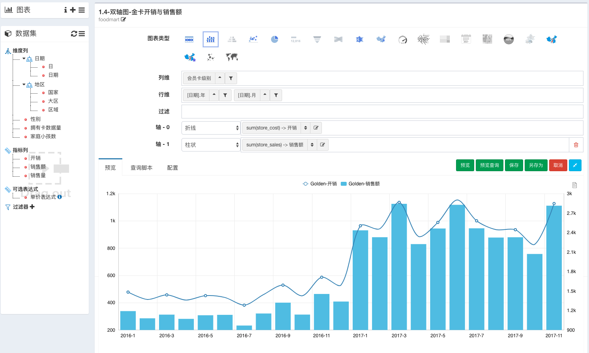

## 介绍
CBoard由[上海楚果信息技术有限公司](http://www.chuguotech.com/)主导开源, 它不仅仅是一款**自助BI数据分析**产品, 还是开放的**BI产品开发**平台:
- **用户**只需简单妥妥拽拽就能自助完成数据多维分析与报表设计
- **开发者**能够简单扩展连接所有你的Java程序能够触及的数据

  

## CBoard社区版用户
希望你们logo出现在此, [请点击登记@Github](https://github.com/TuiQiao/CBoard/issues/122), 或者[请点击登记@Gitee](https://gitee.com/tuiqiao/CBoard/issues/IMLIJ)提供一张无底色logo图片

  

## 架构图
轻量级的技术架构, 与国内开发者耳熟能详的技术栈, **自研多维分析引擎**, 完成您在数据分析最后一棒的重要接力. 清晰的性能优化线路, 小应用撬动大数据!

  

## 产品特性

* 简洁美观的界面, 简单友好的交互模式
* 交互式自服务拖拽多维分析用户体验, 数据切块, 切片, 排序无所不能
* 一个数据集根据您的拖拽衍生无数不同粒度数据聚合 + 20余种不同展现形式的图表
* 图表数据准实时刷新
* 图表级别权限控制
* 支持多图表数据看板与看板定时邮件发送
* 多种数据源接入
  * JDBC(几乎所有实现了JDBC协议的数据库或数据产品都能轻松接入)
  * 多版本原生Elasticsearch: 1.x, 2.x, 5.x
  * 多版本原生Kylin接入: 1.6, 2.0, 2.1
  * 离线文本文件, JSON文本
* 轻量级的技术架构, 简洁的业务代码, 不依赖任何第三方多维分析引擎, 如果您还在纠结很难玩转Mondrian, 那么CBoard绝对是您很好的一个替代方案
* 数据源轻松扩展接入, 大数据时代纷繁的数据产品层出不穷, 任何昂贵的商业产品也做不到出厂遍支持所有类型数据源的连接, 但是如果你能用Java程序获取您的数据, 那么恭喜你有80%的概率能够把数据源接到CBoard了

### 企业版社区版功能对比
功能 | 社区版 | 企业版
---|:---:|:---:
多种数据源接入| :white_check_mark: | :white_check_mark: 
拖拽式自助多维分析|:white_check_mark: | :white_check_mark: 
20多种图形展示|:white_check_mark: | :white_check_mark: + 明细表 + GIS中国地图
数据仪表盘|:white_check_mark: | :white_check_mark: 
仪表盘图表定时刷新 |:white_check_mark: | :white_check_mark: 
看板布局 | 简单行列编辑，先保存再预览 | 所见即所得体检的自由布局
看板参数 | 通用按钮看板参数 | 日期范围过滤, 复选框, 可搜索下拉选择器与关键词搜索
全屏驾驶舱，监控大屏 | :x: | 完善自适应与高度可订制大屏设计
图表联动 | 面向开发人员，基于原始数据列的简单支持 | 完善的图表联动机制，支持联动到数据集、面向业务人员的简单配置
内联图表| :x: 所有图表必须先在图表设计区设计保存管理 | 可以直接在数据看板设计图表单个图表、看板、外部系统
报表邮件发送|:white_check_mark: | :white_check_mark: 
维度成员自定义分组 | :x: | :white_check_mark: 
维度成员自定义排序 | :x: | :white_check_mark: 
图表微调 | 支持简单的图表微调 | 增强
明细表 | :x: | :white_check_mark: 
基于明细数据的GIS地图 | :x: | :white_check_mark: 
数据权限控制| 图表级 | :star::star: 单元格级别基于角色的权限控制
基于文件夹的资源管理方案 | :x: 虚拟目录无文件夹方案 | 类似操作系统的统一实体文件夹资源方案
高级交叉表 | :x: | :star::star: 支持同比、环比、占比、总计、小计等高级计算，单元格条件样式 
IFrame外部系统集成  | :x: | 支持看板级别IFrame集成，可传参
SDK级别外部集成  | :x: | :white_check_mark: 便于个性化集成
前端技术架构 | AngularJS | VueJS + ES6 + Webpack，优化首页加载速度，更适应于云端部署
专业权威技术支持 | :x: | :white_check_mark: 为您的生产环境保驾护航
研发计划 | :x: 维护为主 | 贴近企业实际需求的长期产品研发计划 

?> 更多企业级的功能与特性请访问我们官网: [上海楚果信息技术有限公司](http://www.chuguotech.com/)

## 联系我们
如果你喜欢我们的产品, 可以放心从我们的社区版开始使用, 在产品商业化的支持下同时我们会尽最大的努力维护上社区版的稳定, 后期在不影响公司业务的前提下, 会逐步开放更多的基础开发平台.
在此期间, 所有提交的PR正常处理, 如果你发现产品有任何Bug, 请在Github[Issue模块](https://github.com/TuiQiao/CBoard/issues)向我们反馈.

## 正在招聘
我们正在寻找在相关领域有技术有热情的**前端开发**小伙伴, 与**产品销售**小伙伴, 如果您看好公司发展前景, 请将您的简历发送到: *hr@chuguotech.com*, 有机会成为我们技术合伙人哦!
[职位链接](http://www.chuguotech.com/2)

:books: 更多文档
- [:cn: 帮助文档](http://peter_zhang921.gitee.io/cboard_docsify/#/zh-cn/)
- [:uk: Document](https://tuiqiao.github.io/CBoardDoc/#/en-us/)

## 中国用户QQ交流群

- 重启交流群须知
    - 在讨论相关问题之前，请务必自己阅读[官方文档](http://peter_zhang921.gitee.io/cboard_docsify/#/zh-cn/), 相信大部分问题您都能在文档中找到答案
    - 用户交流群是为方便CBoard使用者之间进行沟通，请注意**不是答疑群，请大家能够尽量互相帮助**
    - 管理员会定义清理最近3个月不曾发言的僵尸用户
    - 在Issue系统里面搜索看看是否有类似问题
    - 确定是程序上的bug请再GitHub issue系统里面[创建新的issue](https://github.com/TuiQiao/CBoard/issues/new)， 参照如何真确提问创建Issue主题
        - What steps will reproduce the problem?（该问题的重现步骤是什么？）
        - What is the expected output? What do you see instead?（你期待的结果是什么？实际看到的又是什么？）
        - What version of the product are you using? On what operating system?（你正在使用产品的哪个版本？在什么操作系统上？）
        - Please provide any additional information below.（如果有的话，请在下面提供更多信息。）

- 1群：301028618 (已满, 请不要再申请入群)
- 2群：985222441 