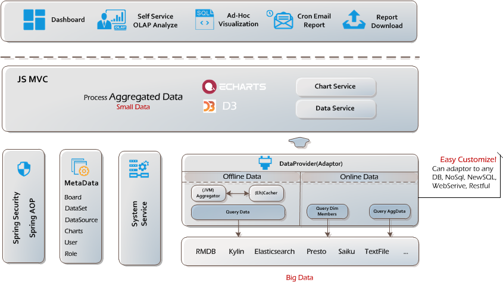

## 介绍
CBoard由[上海楚果信息技术有限公司](http://www.chuguotech.com/)主导开源, 它不仅仅是一款**自助BI数据分析**产品, 还是开放的**BI产品开发**平台:
- **用户**只需简单妥妥拽拽就能自助完成数据多维分析与报表设计
- **开发者**能够简单扩展连接所有你的Java程序能够触及的数据

  

## CBoard社区版用户
希望你们logo出现在此, [请点击登记@Github](https://github.com/TuiQiao/CBoard/issues/122), 或者[请点击登记@Gitee](https://gitee.com/tuiqiao/CBoard/issues/IMLIJ)提供一张无底色logo图片

  

## 架构图
轻量级的技术架构, 与国内开发者耳熟能详的技术栈, **自研多维分析引擎**, 完成您在数据分析最后一棒的重要接力. 清晰的性能优化线路, 小应用撬动大数据!

  

## 产品特性

* 简洁美观的界面, 简单友好的交互模式
* 交互式自服务拖拽多维分析用户体验, 数据切块, 切片, 排序无所不能
* 一个数据集根据您的拖拽衍生无数不同粒度数据聚合 + 20余种不同展现形式的图表
* 图表数据准实时刷新
* 图表级别权限控制
* 支持多图表数据看板与看板定时邮件发送
* 多种数据源接入
  * JDBC(几乎所有实现了JDBC协议的数据库或数据产品都能轻松接入)
  * 多版本原生Elasticsearch: 1.x, 2.x, 5.x
  * 多版本原生Kylin接入: 1.6, 2.0, 2.1
  * 离线文本文件, JSON文本
* 轻量级的技术架构, 简洁的业务代码, 不依赖任何第三方多维分析引擎, 如果您还在纠结很难玩转Mondrian, 那么CBoard绝对是您很好的一个替代方案
* 数据源轻松扩展接入, 大数据时代纷繁的数据产品层出不穷, 任何昂贵的商业产品也做不到出厂遍支持所有类型数据源的连接, 但是如果你能用Java程序获取您的数据, 那么恭喜你有80%的概率能够把数据源接到CBoard了

?> 更多企业级的功能与特性请访问我们官网: [上海楚果信息技术有限公司](http://www.chuguotech.com/)

## 联系我们
如果你喜欢我们的产品, 可以放心从我们的社区版开始使用, 在产品商业化的支持下同时我们会尽最大的努力维护上社区版的稳定, 后期在不影响公司业务的前提下, 会逐步开放更多的基础开发平台.
在此期间, 所有提交的PR正常处理, 如果你发现产品有任何Bug, 请在Github[Issue模块](https://github.com/TuiQiao/CBoard/issues)向我们反馈.

## 正在招聘
我们正在寻找在相关领域有技术有热情的**前端开发**小伙伴, 与**产品销售**小伙伴, 如果您看好公司发展前景, 请将您的简历发送到: *hr@chuguotech.com*, 有机会成为我们技术合伙人哦!
[职位链接](http://www.chuguotech.com/2)

:books: 更多文档
- [:cn: 帮助文档](http://peter_zhang921.gitee.io/cboard_docsify/#/zh-cn/)
- [:uk: Document](https://tuiqiao.github.io/CBoardDoc/#/en-us/)